## Даталогическая таблица

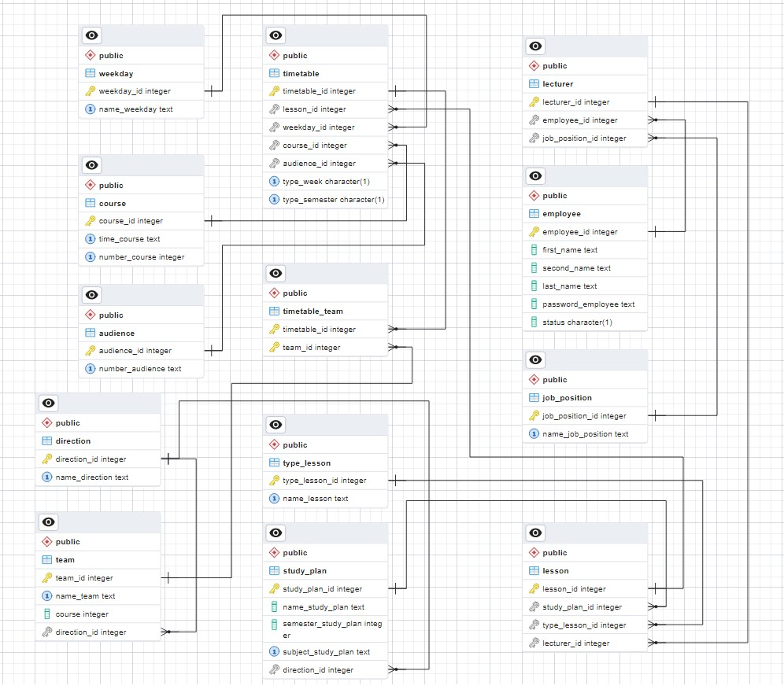

## ER-диаграмма

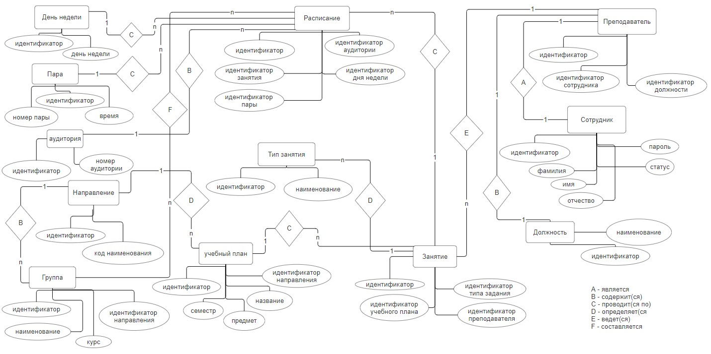

## Пример работы клиентского интерфейса

При запуске программы открывается окно входа, в котором пользователю необходимо ввести логин и пароль для авторизации, если он является сотрудником (рисунок 1). Если же программой воспользоваться хочет студент, то для него предусмотрена опция «Расписание групп». Нажав на неё, перед ним откроется поле ввода названия группы, в котором он может только просматривать расписание интересующей группы (рисунок 2). 

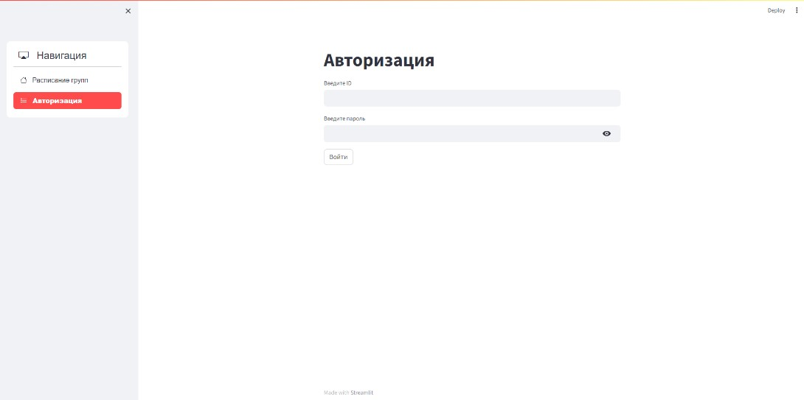

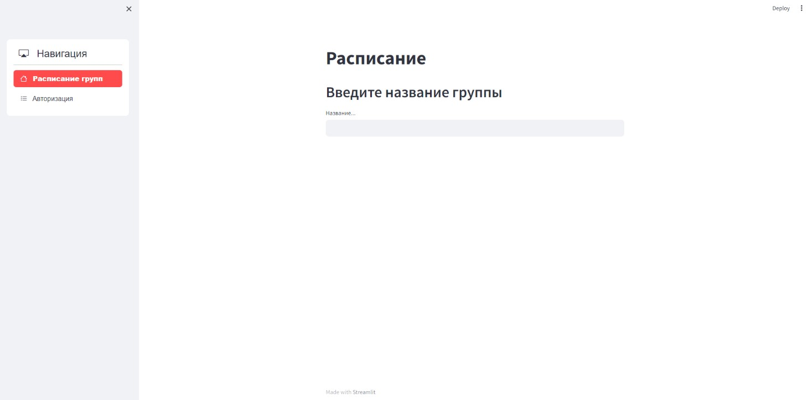

Пользователь может посмотреть расписание с выбором интересующей недели (рисунок 3).

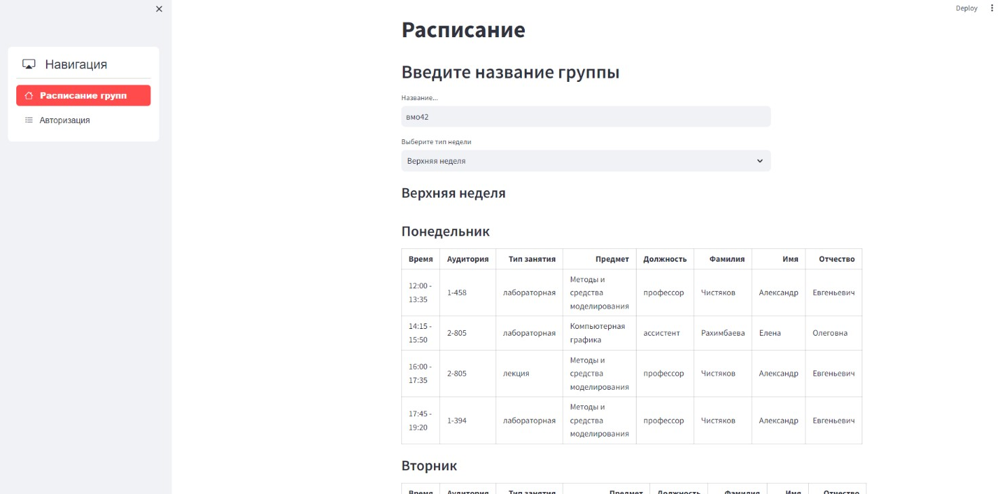

Если зайти под учётной записью преподавателя, то в интерфейсе появится меню выбора просмотра личного расписания, либо расписания групп (рисунок 4).

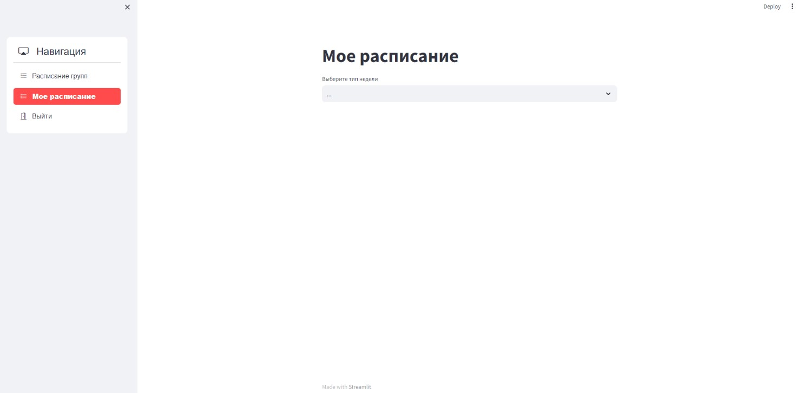

При выборе поля «Мое расписание» и типа недели, нам выводится таблица с полями дня недели, времени, аудитории, группы и предмета (рисунок 5).

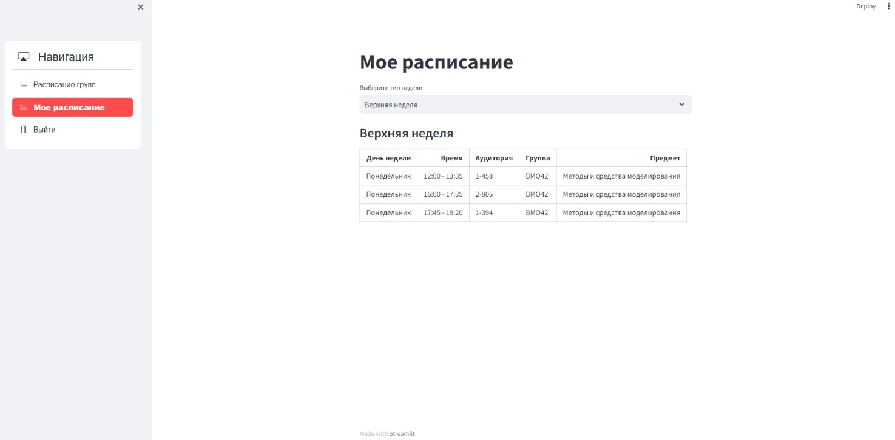

При входе под учетной записью администратора в поле навигации появляются следующий доступный функционал: «Расписание групп», «Добавление», «Обновление», «Удаление», «Направление», «Учебный план», «Откат», «Выйти» (рисунок 6).

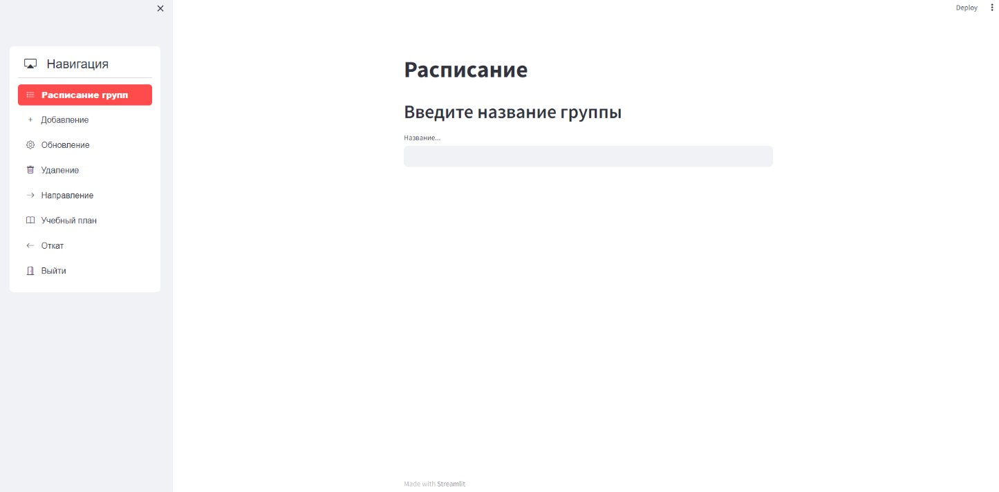

При выборе просмотра «Расписание групп», нам доступно просмотреть расписание группы за интересующий нас семестр и интересующий тип недели (рисунок 7).

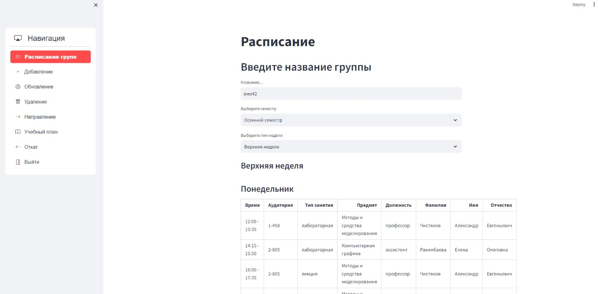

При выборе поля «Добавление», нам доступен выбор, куда добавить необходимую информацию (рисунок 8).

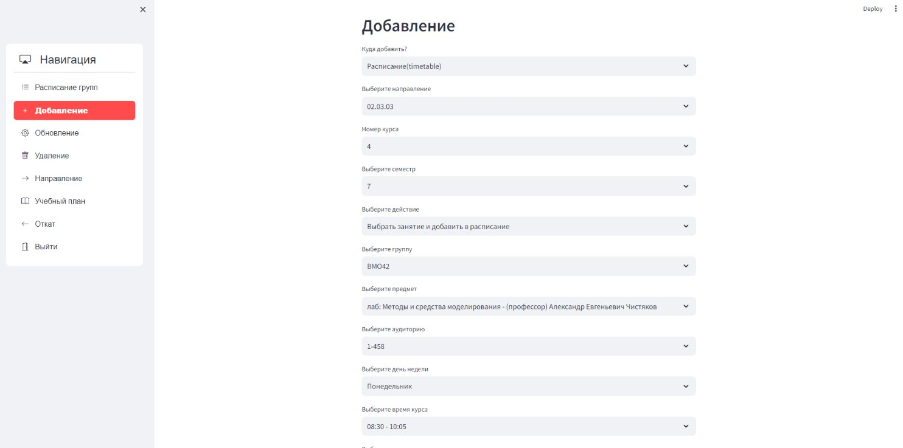

При выборе поля «Обновление», нам доступен выбор, где мы можем обновить необходимую информацию (рисунок 9).

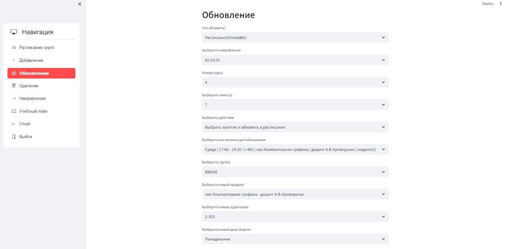

При выборе поля «Удаление», нам доступен выбор, где мы можем удалить необходимую информацию (рисунок 10).

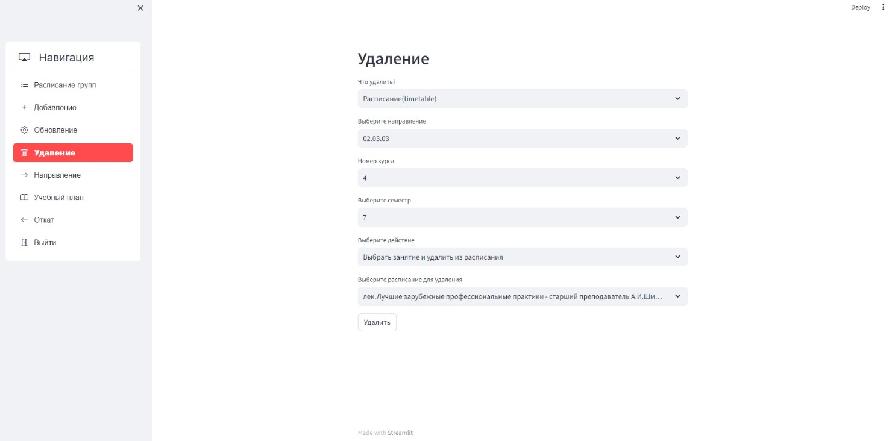

При выборе поля «Направление», нам доступен выбор, по добавлению, обновлению, удалению направления (рисунок 11).

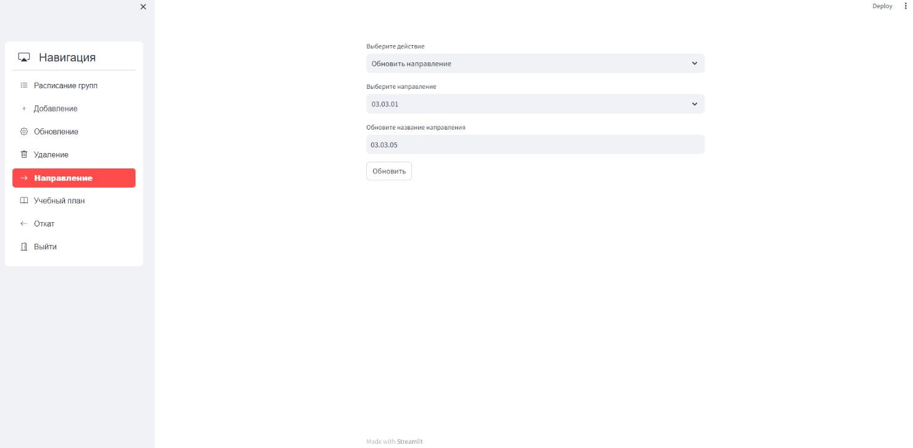

При выборе поля «Учебный план», нам доступна работа с данными учебных планов каждого направления (рисунок 12).

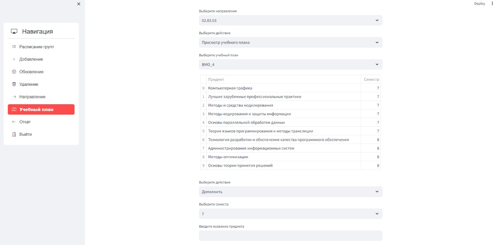

При выборе поля «Откат», нам доступен функционал для отката нежелательных значений по времени (рисунок 13).

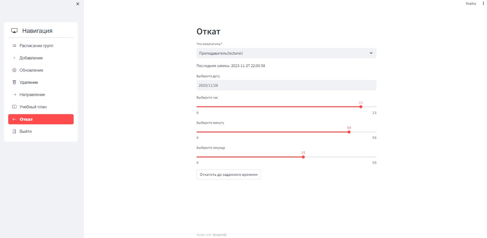

